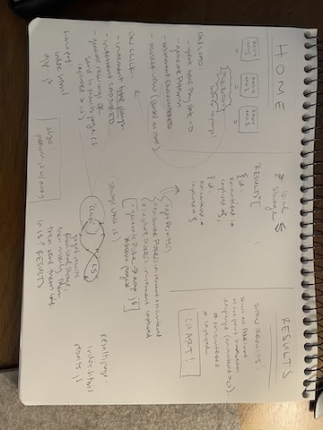

# Pokemon Catcher App

## HTML Elements Needed
- [ ] Home Page
  - [ ] Three pokemon image buttons/(radios?)
    * need id's to watch event listeners
- [ ] Results Page
  - [ ] Render results in a chart

## State to Keep track of
- [ ] **totalPlays** -- total plays
- [ ] **capturePokemon** -- selected button // "pick"
- [ ] **encounterPokemon** -- the three generated per session // "shown"

## user events
* Page Load
  * update state -- **totalPlays** (total plays = 0)
  * generate three pokemon 
  * update state -- **encounterPokemonr**
  * update view based on state -- render
* Button Click
  * increment total plays state -- **totalPlays**
  * increment selected pokemon state -- **capturePokemon**
  * if (plays < 10) 
      * generate three pokemon 
      * update state -- **encounterPokemon**
      * update view based on state -- render
  * else () 
    * send user to results page


## functions


### Local Storage Utils Functions -- could be in a separate *storage-utils.js*
* findById -- reference e-commerce lab for this function
* setPokedex -- TWO FUNCTIONS to SEND items to localStorage 
  * *Encountered* -- 
    * getResults
    * increment encounterPokemon
    * stringify
    * localStorage.setItem('RESULTS', string)
  * *Selected* -- 
    * getResults
    * increment capturePokemon
    * stringify
    * localStorage.setItem('RESULTS', string)
* getPokedex -- a function to GET items from localStorage 
  * looks for 'RESULTS' in local storage
  * if ('RESULTS') exists 
    * localStorage.getItem('RESULTs')
    * JSON.parse
    * return results array
  * else (no 'RESULTS')
    * return empty array

  ```
  'RESULTS' = [
    {
        id: '',
        encountered: #,
        captured: #
    },
    {
        id: '',
        encountered: #,
        captured: #
    },
    ...


### home page Functions -- app.js

* generatePokemon function -- 
  * use array.length and Math.random / Math.floor to **create an index**
    *  use a while loop to make sure the three random numbers are not the same
    (rand1 === rand2 || rand2 === rand3 || rand1 === rand3 )
  * call Encountered 
  * render image onto page

* increment totalPlay -- number of plays


## RESULTS PAGE! 
## Html: 
  * For each item in results: 
      * Image
      * Header with name of fruit
      * Show how many times it’s been shown //encountered
      * Show how many times it’s been picked  //captured

## results.js
  * Get the data from local storage
  * Loop through each item in the results
  * Get it’s data from fruits.js (using findbyID)
  * Render the results (img, header, data)





# stretch goal

## "As the user is playing, display captures and encounters for each pokemon below each pokemon image"

* This information is stored in local storage 
* This will show on button-click 
* So, on button click, go get the information from LS about encouters & captures, and show that information in a span 

### plan: 
  * add two ```<span>``` elements to each radio button, one for encounter and one for capture
  * on the button click, 3 images are shown. each of these has information that is being stored in LS (id, encouter, capture). 
  * we want to expand what is shown on the button click: we want to grab the encounter and the capture that is in LS and display it in the span elements of each of the pokeCards. 
  * i think this happens in the generatePoke() app (and not on the button click itself?)

- [x] add html span for encounter on radio button
- [ ] add html span for capture on radio button
- [ ] grab spans in app.js
- [ ] update content of span to be the encounter/capture data in LS